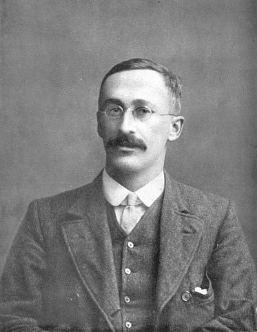

<!--
%\VignetteEngine{knitr::rmarkdown}
%\VignetteIndexEntry{Chapter 3: g - Storyboard}
-->    

### The student t distributions was developed by [William Sealy Gosset](https://en.wikipedia.org/wiki/Student%27s_t-distribution) under the pseudonym Student. 


```{r}

```

***

In the English-language literature the distribution takes its name from William Sealy
Gosset's 1908 paper in Biometrika under the pseudonym "Student". Gosset worked at the
Guinness Brewery in Dublin, Ireland, and was interested in the problems of small samples
- for example the chemical properties of barley where sample sizes might be as few as
$3$. One version of the origin of the pseudonym is that Gosset's employer preferred staff
to use pen names when publishing scientific papers instead of their real name, so he
used the name "Student" to hide his identity. Another version is that Guinness did not
want their competitors to know that they were using the t-test to determine the quality of
raw material

Taken from [wikipedia](https://en.wikipedia.org/wiki/Student%27s_t-distribution#History_and_etymology)

### The distribution has a parameter called _degrees of freedom_ - `df`

```{r}
setnicepar()
x = seq(-5, 5, 0.01)
plot(x, dt(x, 1), type="l", xlab="x", ylab="Density", 
     ylim=c(0, 0.4), main="The t distribution")
lines(x, dt(x, 5), col="SteelBlue")
grid()
```

### When `df=1`, the distribution has long tails

```{r}
set.seed(1)
x = rt(100, 1)
setnicepar()
hist(x, breaks="fd", col="steelblue", xlim=c(-30, 30), 
     main="100 samples from a t distribution")
abline(h=0)
```

***

To sample from the $t$-distribution, we use the `rt` function in R.

